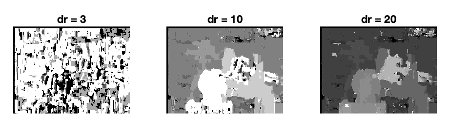

# Stereo Matching

This is a MATLAB implementation of a simple window-based [stereo matching](https://www.sciencedirect.com/topics/engineering/stereo-matching) algorithm for rectified stereo pairs.
To get the ground-truth disparity map, pick a window around each pixel in the first (reference) image, 
and then search the corresponding scanline 
in the second image for a matching window. 
The output should be a disparity map (third image) with respect to the first view.
 
  

The following pictures show the ground-truth disparity map for different disparity ranges; 
normalized correlation is used for the first row of images,
sum of squared differences is used for the second row of images.
 

